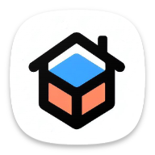

# Decor Sense



Decor Sense is an Android application built using ARCore, Sceneform, and Firebase. It is designed to detect the user's environment, send dimension updates, provide useful product suggestions, and allow users to visualize and try out decor items in an augmented reality (AR) environment. Additionally, the app manages user information, product data, and authentication through Firebase.

## Features

- **Environment Detection:** Decor Sense uses ARCore to detect the user's environment and place virtual decor items realistically.

- **Product Suggestions:** The app provides curated product suggestions based on the user's preferences and space dimensions.

- **AR Visualization:** Users can try out different decor items in their AR environment to visualize how they would look in their space.

- **User Data Management:** Decor Sense securely stores user information and preferences.

- **Authentication:** Firebase authentication is used to manage user sessions and login details.

## Getting Started

These instructions will help you get a copy of the project up and running on your local machine for development and testing purposes.

### Prerequisites

- Android Studio (2022.3.1)
- ARCore Supported Android Device. For setting up AR in emulator refer video tour or this link for more info: https://www.google.com/url?sa=t&rct=j&q=&esrc=s&source=web&cd=&ved=2ahUKEwi0tJnO8IWDAxXhjokEHcLfCM0QFnoECB0QAQ&url=https%3A%2F%2Fdevelopers.google.com%2Far%2Fdevelop%2Fc%2Femulator&usg=AOvVaw2-1z_TnjF8DY38VDNX4XXk&opi=89978449
- Firebase Account  (Credentials shared separately)

### Installation

1. Clone the repository:

   ```shell
   git clone https://github.com/CS5520FeinbergFall2023/group-project-group-5
   ```

2. Open the project in Android Studio.

3. Build and run the project on your ARCore-supported Android device.

## Usage

- Launch the Decor Sense app on your ARCore-supported device.
- Sign in or create an account with the shared credentials.
- Follow the video tour to detect your environment and get suggestions.
- Browse and visualize decor items in your AR environment.

## Contributing

If you would like to contribute to this project, please follow the [Contributing Guidelines](CONTRIBUTING.md).

## License

This project is licensed under the MIT License - see the [LICENSE](LICENSE) file for details.

## Acknowledgments

- Thanks to the ARCore, Sceneform, and Firebase communities for their fantastic libraries and documentation.

## Contact

For any inquiries or feedback, please contact the project maintainers:

- Ajay Inavolu - [inavolu.a@northeastern.edu]
- Jiaming Xu - [xu.jiami@northeastern.edu]
- Kiran Shatiya - [thirugnanasambanth.k@northeastern.edu]
- Vishrutha Abbaiah Reddy - [abbaiahreddy.v@northeastern.edu]
- Project Link: [https://github.com/CS5520FeinbergFall2023/group-project-group-5](https://github.com/CS5520FeinbergFall2023/group-project-group-5)


