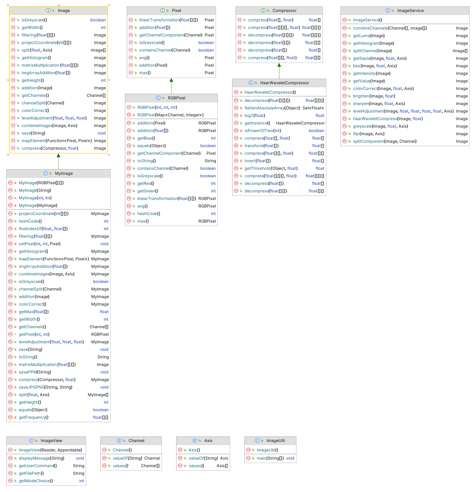

# **CS5010_Assignment_Image-Manipulation-and-Enhancement**
CS5010 Assignment Image Manipulation and Enhancement

## **Overview**

This collabration assignment is completed by Jiaming Xu (xu.jiami@northeastern.edu) and Jiaoyang Du (du.jiao@northeastern.edu).

The example images displayed in res/ are all photographs taken by Jiaming Xu, who authorized the use of the images as examples in the assignment.

In this document, an overview of the components of the code will be given, and our design will be explained.

## **Classes and Interfaces**


```
src/
├─ util/
│  ├─ ImageUtil.java
├─ view/
│  ├─ ImageView.java
├─ controller/
│  ├─ ImageController.java
├─ model/
│  ├─ compressor/
│  │  ├─ Compressor.java
│  │  ├─ HaarWaveletCompressor.java
│  ├─ image/
│  │  ├─ Image.java
│  │  ├─ MyImage.java
│  ├─ pixel/
│  │  ├─ Pixel.java
│  ├─ Axis.java
│  ├─ Channel.java
├─ service/
│  ├─ ImageService.java
test/
├─ file/
│  ├─ test_command_files...
├─ img/
│  ├─ test_images...
├─ model/
│  ├─ ImageTest.java
│  ├─ MyImageTest.java
│  ├─ RGBPixelTest.java
├─ ImageControllerTest.java
├─ ImageServiceTest.java
├─ MockImageService.java
├─ MockImageView.java
res/
├─ sample_images...

```


We're using MVC pattern in the assignment:  
- ImageView class is about showing views to the user. ImageUtil class and ImageController class are those handling user input. 
- ImageService class is much like the service layer in Spring MVC and it helps to operate on the models when the task is too complicated to be written all in controllers. 
- Finally, we have model classes like RGBPixel and MyImage, representing RGB pixels and 8 bit RGB images. 

The package structure is as follows:


Other interfaces and design purpose is further explained down below.

## Interface

### Pixel

#### Purpose
This interface is used to describe pixels. All pixels use a map to store the channels it has and the values in the corresponding channel.

#### Methods

- public boolean containsChannel(Channel channel)
    - Check if the pixel contains the given channel.

- public abstract Pixel linearTransformation(float[][] matrix) throws IllegalArgumentException;
    - Performs linear transformation on the pixel valus. For example, for an RGB matrix, that is calculate 3x3 matrix * 3*1 [r,g,b].

- public abstract Pixel addition(float[] matrix) throws IllegalArgumentException;
    - Adds matrix to pixel. E.g. calculate pixel[r',g',b'] = matrix[x,y,z] + pixel[r,g,b].
- public abstract Pixel addition(Pixel pixel) throws IllegalArgumentException;
    - Adds two pixels. E.g. calculate [r,g,b] + [r',g',b'] for two RGB pixels.

- abstract Pixel getChannelComponent(Channel channel);
    - Get certain channel component of the pixel, which means the result pixel has same value as the original one on the given channel, but with 0 on the other channels.

- public abstract Pixel max();
    - Calculate the max value among all channels of the pixel and get a pixel with all channels this value.

- public abstract Pixel avg();
    - Calculate the average value among all channels of the pixel and get a pixel with all channels this value.
- public boolean isGreyscale()
    - Check if this pixel is greyscale by checking if each channel has the same value. The default implementation traverse all values in channels to see if they are all same.

- public String toString()
    - Returns a string representation of the pixel by printing out the channels and corresponding values.


### Image

#### Purpose
This interface describes images composed of pixels. It contains commom methods across all kind of images, like multiplying matrix to every pixel, adding value to pixels, etc.

The key design here is to categorize image operations according to the mechanisms of the operations.  While image class presents methods to realize the calculations described in the category column, the operations in the service class make use of them and bring more operations.

| Operation    | Category |
| -------- | ------- |
| get single channel image  | matrix multiplication (on pixel, 3x3 matrix with 3x1 rgb)   |
| value | matrix multiplication     |
| luma    | matrix multiplication    |
| intensity    | matrix multiplication    |
| greyscale    | matrix multiplication    |
| flip    | affine transformation (project coordinates according to matrix and move pixel at (x,y) to the projected position (x',y'))    |
| brighten    | pixel addition (adding values to channels)    |
| darken    | pixel addition    |
| combine   | pixel addition    |
| blur   | filtering (on the whole image)    |
| sharpen   | filtering    |
| sepia   | matrix multiplication    |

#### Methods
- void save(String path) throws IllegalArgumentException;
    - Save image to local file.
- int getHeight();
    - Get height of the image.
- int getWidth();
    - Get width of the image.

- Image matrixMultiplication(float[][] matrix) throws IllegalArgumentException;
    - Perform matrix multiplication on each of the pixel in the image and return image with the result pixels. This fuction achived by making use of mapElement(pixel -> pixel.linearTransformation(matrix)). Please see down below for introduction to function mapElement.

- Image channelSplit(Channel channel) throws IllegalArgumentException;
    - Split image of the given channel (resulted in one colored image).

- Image filtering(float[][] kernel);
    - Perform filtering on the image

- Image mapElement(Function<Pixel, Pixel> function);
    - Gets a new image that is resulted from performing the same function to every pixel in the original image in the corresponding position through row and column traverse. This fuction helps with code reuse when many image operations are traversing all pixels in the image and doing the same thing to each of the pixel. 

- Image projectCoordinate(int[][] projectMatrix);
    - Project coordinate of the original component element and actually move the pixels. For example,

        1 0 w

        0 -1 h

    
        projects (x,y) to (x+w,-y+h), and project accordingly pixels in the old image to the new one.

- Image addition(Image that) throws IllegalArgumentException;
    - Perform addition with another image.

- Image imgArrayAddition(float[] matrix) throws IllegalArgumentException;
    - Perform array addition an image with given matrix. This is acheived by performing array addition on every pixel, by utilizing mapElement(pixel -> pixel.addition(matrix))

- Channel[] getChannels();
    - Get channels of pixels in the image.

- Image[] split(float percentage, Axis axis) throws IllegalArgumentException;
    - Split the images to 2 images according to the given percentage on the given axis.

- Image combineImages(Image other, Axis axis) throws IllegalArgumentException;
    - Combine two images together on the given axis.

- Image getHistogram();
    - Get histogram of the current image.

- Image colorCorrect();
    - Color-correct an image by aligning the meaningful peaks of its histogram.

- Image levelAdjustment(float black, float mid, float highlight);
    - Perform level adjustment on the image.


### Compressor
This interface represents compressors that can compress and decompress given data. It currently has the following overriding methods to deal with 1D and 2D arrays.

#### Methods

- float[][] compress(float[][] matrix, float ratio);
    - Compress a 2D float array with given ratio.

- float[] compress(float[] nums, float ratio);
    - Compress an 1D float array.
    
- float[][] decompress(float[][] compressed);
    - Decompress a 2D float array with given ratio.

- float[] decompress(float[] compressed);
    - Decompress an 1D float array.

## Enums

### Axis

#### Purpose
This enum is used to represent axis. Currently we only deal with 2D images, so we only have two axis, X and Y.

### Channel

#### Purpose
This enum is used to represent channels. Currently we only deal with RGB images, so we only have three channels, RED, GREEN, and BLUE.

## Classes

### RGBPixel 

#### Purpose
This class represents RGB pixels, that is, pixels with and only with RGB channels. It extends the Pixel abstract class.

#### Fields
- Besides the inhereted Map<Channel, Integer> channels, it also has a constant private final int bitDepth = 8.

#### Methods
- public RGBPixel(int red, int green, int blue)
    - Constructor with red, green and blue values. It will automatically clamp the values, i.e., set value to zero if it's negative, and set value to 2^bitDepth-1 if it's larger than that. It also uses EnumMap to store this channel-value relation ship which makes operation quicker.
- private RGBPixel(Map<Channel, Integer> channels)
    - Private constructor that takes given channels map.
- public boolean isGreyscale()
    - Check if this pixel is greyscale by checking if the rgb channel values are all same.
- public Pixel getChannelComponent(Channel channel) throws IllegalArgumentException
    - Get certain channel component of the pixel by traversing all channels and put corresponding value to corresponding channel in the result pixel while keeping other channels zero.
- public RGBPixel linearTransformation(float[][] matrix) throws IllegalArgumentException
    - Calculate 3x3 matrix * [r,g,b] following matrix operation definition.
- public RGBPixel addition(float[] matrix) throws IllegalArgumentException
    - Calculate pixel[r',g',b'] = matrix[x,y,z] + pixel[r,g,b] following matrix operation definition.

- public RGBPixel addition(Pixel pixel) throws IllegalArgumentException
    - Calculate pixel[r,g,b] + pixel[r',g',b']

- public RGBPixel max()
    -  Calculate the max value among all channels of the pixel and get a pixel with all channels this value.

- public RGBPixel avg()
    -  Calculate the average value among all channels of the pixel and get a pixel with all channels this value.

- public int getRed()
    - Get the value of the red channel by getting from the EnumMap.

- public int getBlue()
    - Get the value of the red channel by getting from the EnumMap.

- public int getGreen()
    - Get the value of the red channel by getting from the EnumMap.

- public boolean equals(Object o)
    - Compare if two objects are equal. If both are RGB pixel, compare the channels.

- public int hashCode()
    - Get the hashcode of the object.


### MyImage

#### Purpose
This class represents 8 bit depth RGB images that is consisted of RGBPixels. It extends the Image abstract class.

#### Fields
- private final RGBPixel[][] pixels
    - 2D RGBPixel array that represents every pixel in the image
- private final int height
    - int that represents the height of the image
- private final int width
    - int that represents the width of the image

#### Methods
-  public MyImage(int height, int width)
    - Construct all black image with given height and width.

-  private MyImage(Pixel[][] pixels)
    - Private constructor that takes 2d array of pixels and checks if the type are RGBPixels and construct with given pixels array.

-  public MyImage(String path) throws IllegalArgumentException
    - Construct an image with given local path. It uses bufferedImage if given image is JPG or PNG, and directly parses the file if the image is PPM.

-  public void save(String path) throws IllegalArgumentException
    - Save image to local file. It calls different tool functions to save to local file according to the extension.

-  private void savePPM(String path) throws IOException, IllegalArgumentException
    - Private helper functions that saves MyImage to local PPM file. 

-  private void saveJPGPNG(String path, String format)
    -Private helper functions that saves MyImage to local JPG/PNG file. 

-  private void setPixel(int x, int y, Pixel pixel)
    - Set pixel at position x, y in this image to the given pixel.

-  RGBPixel getPixel(int x, int y)
    - Gets the pixel at x,y.

- boolean isGreyscale();
    - Check if an image is greyscale by checking if all of its pixels are greyscale. 

-  public MyImage filtering(float[][] kernel) throws IllegalArgumentException
    - Perform filtering an image with given matrix. By traversing and putting the center of the kernel to each position on the image and calculates the area it covers, it adds the values when corresponding pixel and kernel element multiply to make the final result of the pixel where the kernel now lies.

-  public MyImage channelSplit(Channel channel) throws IllegalArgumentException
    - Split channels of the given image by making use of the pixel's getChannelComponent function.

-  public MyImage imgArrayAddition(float[] matrix) throws IllegalArgumentException
    - Perform array addition an image with given matrix.

-  public MyImage addition(Image that) throws IllegalArgumentException
    - Perform addition with another image by adding every pair of pixels.

-  public MyImage projectCoordinate(int[][] projectMatrix)
    - Project coordinate of the original component element. For example, 1 0 w 0 -1 h projects (x,y) to (x+w,-y+h), and project accordingly pixels in the old image to the new one. 

-  public MyImage mapElement(Function<Pixel, Pixel> function)
    - Map all pixels in the image with given pixel function with traversal.

-  public Channel[] getChannels()
    - Get channels of pixels in the image. For this case, Channel.RED, Channel.GREEN and Channel.BLUE

- public MyImage compress(Compressor compressor, float ratio)
    - Compress the image by calling compress on the value array of red channel, green channel and blue channel of the image first, and then call decompress on them and truncate the result to make sure the result image is of the same size as the original one.

- public MyImage[] split(float percentage, Axis axis) throws IllegalArgumentException
    - Split the images to 2 images according to the given percentage by calculating the size(round to the nearest integer) of the two parts and traversing the original image. The result will always be a MyImage[2] and if the side length of one part is 0, it will be put as a null.

- public MyImage combineImages(Image other, Axis axis) throws IllegalArgumentException
    - Combine two images together on the given axis by creating a new image with disired added size and interating and assigning pixels with same rgb values on the corresponding position on the original images.
    
-  private float[][] getFrequency()
    - Get appearance frequency of colors in the image by interating all pixels and counting the apearances of each color in three channels respectively and finally get the frequency by deviding the count with the image size (total pixel number). The result is float[3][256], representing the 3 channels and frquency of each of the 256 values.

- private float getMax(float... nums)
    - Find the max among the given numbers by iteration.

- private int findIndexOf(float value, float[] arr)
    - Find index of the first occurance of given value in the given array by traversing.

- public MyImage getHistogram();
    - Get histogram of the current image. It calls getFrequency to get frequency of the three channels, draw a vertical line from one value to the next one by just setting the pixels on the result image. Finally, make the rest space on the result image white by checking if there're null in the pixel 2d array.
    - Do note that colors overlay instead of mix (as shown in the instructions) in the order of red, green and blue. For examples, blue lines overlays green and red lines if they do appear in the same position.

- public MyImage colorCorrect();
    - Color-correct an image by aligning the meaningful peaks of its histogram. It uses getFrequency to get frequency of the three channels, excluding color values less or equal to 10 and more or equal to 250. Then it calls getMax and findIndexOf to get the indices of the first peak in the 3 channels, calculate the average and the gap/delta, and adds the delta to all values in thie channel by calling imgArrayAddition method.
- public MyImage levelAdjustment(float black, float mid, float white) throws IllegalArgumentException

    - Perform level adjustment on the image. It fits the curve ax^2_bx+c with the given points, calculates new red, new green and new blue values using the curve which makes the final new result image.

-  public boolean equals(Object o)
    - Check if two objects are identical.

-  public int hashCode()
    - Returns a hash code value for the object. It takes into consideration height, width and the pixel array.

- public String toString()
    - Returns a string representation of the object by printing out all the pixels.

### HaarWaveletCompressor

#### Fields
- public static final float sqrt2 = (float) Math.sqrt(2)
    - To help ease the calculation representations.

- private static HaarWaveletCompressor instance = new HaarWaveletCompressor();
    - Singleton design pattern to share one instance of the compressor across the program.

#### Methods
-  private HaarWaveletCompressor() {}
    - Private empty constructor.

-   public static HaarWaveletCompressor getInstance()
    - Get the singleton instance of the compressor.

- public float[][] compress(float[][] matrix, float ratio) throws IllegalArgumentException
    - Compress a 2D float array. It just follows the algorithm in the instructions. Finally it calls getThreshold to get the threshold and set those below the theshold (in terms of absolute value) to zero.

- public float[] compress(float[] nums, float ratio) throws IllegalArgumentException
    - Compress a 1D float array. It just follows the algorithm in the instructions. Finally it calls getThreshold to get the threshold and set those below the theshold (in terms of absolute value) to zero.

- public float[][] decompress(float[][] compressed) throws IllegalArgumentException
    - Decompress a 2D float array. It just follows the algorithm in the instructions.

- public float[] decompress(float[] compressed) throws IllegalArgumentException
    - Decompress an 1D float array. It just follows the algorithm in the instructions.

- private float[] transform(float[] nums)
    - Transform an float array by averaging and differencing as the instructions. 

- private float[] invert(float[] nums)
    - Revert the transform made to a float array.

- private boolean isPowerOfTwo(int n)
    - Check if the given number is power of two.

- private float getThreshold(Object numsArray, float ratio) throws IllegalArgumentException
    - Calculate the threshold with the given ratio. It can work with arbitary dimension array. It calls flattenAbsoluteArray to flatten the array to 1D with all numbers in their absolute values and already neglecting the zeros, sort them in ascending order, return the element at the corresponding index (total non-zero value length*ratio-1).

- private List<Float> flattenAbsoluteArray(Object array) throws IllegalArgumentException
    - Flatten given array to 1D with all numbers in their absolute values.

- private float log2(float number)
    - Calcute log base 2 of the number.


### ImageService

#### Purpose
This class represents image operations. It implements ImageServiceInterface interface. The key design is similar to the categorization mentioned in the part for Image interface. Here we differentiate methods by different mechanisms or by different arguments passed in to same mechanism. For example, sepia and luma all made use of matrix multiplication, but the matrices used are different.

#### Fields
None

#### Methods
- public Image splitComponent(Image image, Channel channel) throws IllegalArgumentException
    - Get one certain channel of the image (result in one colored image) by calling image.channelSplit(channel).

- public Image blur(Image image, float percentage, Axis splitAxis) throws IllegalArgumentException
    - Split the image with the given percentage and axis, and blur the first image by using the blur matrix in image.filtering(blur)
        ```
        {{0.0625f, 0.125f, 0.0625f},
        {0.125f, 0.25f, 0.125f},
        {0.0625f, 0.125f, 0.0625f}}
        ```
    and combine them back together.

- public Image getValue(Image image) throws IllegalArgumentException 
    - Get value of the image by calling image.mapElement(Pixel::max).

- public Image getIntensity(Image image) throws IllegalArgumentException
    - Get intensity of the image by calling image.mapElement(Pixel::avg).

- public Image getLuma(Image image) throws IllegalArgumentException
    - Get luma of an image by using the luma matrix in image.filtering(blur).
    ```
    {
        {0.2126f, 0.7152f, 0.0722f},
        {0.2126f, 0.7152f, 0.0722f},
        {0.2126f, 0.7152f, 0.0722f}
    }
    ```
- public Image flip(Image image, Axis axis) throws IllegalArgumentException
    - Flip an image by calling image.projectCoordinate(matrix). If it's axis == Axis.Y (horitontal flip), then the matrix is
    ```
    {
        {-1, 0, image.getWidth() - 1},
        {0, 1, 0}
    };
    ```
    else it's
    ```
    {
        {1, 0, 0},
        {0, -1, image.getHeight() - 1}
    };
    ```
- public Image brighten(Image image, float delta) throws IllegalArgumentException
    - Brighten/darken an image with given delta. If delta is negative, then it's darken; if delta is positive, it's brighten. It's achieved by calling  
    return image.imgArrayAddition(matrix) with matrix = {delta, delta, delta}.

- public Image[] splitChannel(Image image) throws IllegalArgumentException
    - Split image channels and result in $channelCount greyscale images by calling channelSplit first then multiply by a matrix whose column index corresponds to each channel (like column 0 for red in rgb) is one (other than that is 0).

- public Image combineChannels(Channel[] channels, Image[] images) throws IllegalArgumentException
    - Combine greyscale images each representing one channel to one multicolor image by first splitting the greyscale images and get single channel images, than add them all using Arrays.stream(splits).reduce(Image::addition) .

- public Image sharpen(Image image, float percentage, Axis splitAxis) throws IllegalArgumentException
    - Split the image with the given percentage and axis, and sharpen the first image with image.filtering(sharpen), where sharpen matrix is
    ```
    {
        {-0.125f, -0.125f, -0.125f, -0.125f, -0.125f},
        {-0.125f, 0.25f, 0.25f, 0.25f, -0.125f},
        {-0.125f, 0.25f, 1f, 0.25f, -0.125f},
        {-0.125f, 0.25f, 0.25f, 0.25f, -0.125f},
        {-0.125f, -0.125f, -0.125f, -0.125f, -0.125f},
    }
    ```
    and combine them back together.
    
- public Image getSepia(Image image, float percentage, Axis splitAxis) throws IllegalArgumentException
    - Split the image with the given percentage and axis, and get sepia version of the image with image.matrixMultiplication(sepia), where the sepia matrix is 
    ```
            {
            {0.393f, 0.769f, 0.189f},
            {0.349f, 0.686f, 0.168f},
            {0.272f, 0.534f, 0.131f}
        }
    ```
    and combine them back together.

- public Image greyscale(Image image, float percentage, Axis splitAxis) throws IllegalArgumentException
    - Split the image with the given percentage and axis, and greyscale the first image with image.matrixMultiplication(greyscale), where greyscale matrix is
    ```
    {
        {0.2126f, 0.7152f, 0.0722f},
        {0.2126f, 0.7152f, 0.0722f},
        {0.2126f, 0.7152f, 0.0722f}
    };
    ```
    and combine them back together.

- public Image haarWaveletCompress(Image image, float ratio) throws IllegalArgumentException 
    - Compress the image with HaarWaveletCompressor by calling the image's compress method.

- public Image getHistogram(Image image) throws IllegalArgumentException
    - Get histogram of the image by calling the getHistogram method on the image.

- public Image colorCorrect(Image image, float percentage, Axis splitAxis)
    - Split the image with the given percentage and axis, and call colorCorrect method on the first part, and combine them back together.

- public Image levelAdjustment(Image image, float black, float mid, float white, float percentage,Axis splitAxis) throws IllegalArgumentException 
    - Split the image with the given percentage and axis, and call levelAdjustment method on the first part, and combine them back together.

### ImageView

#### Purpose
This class is responsible delivering views and communicating with the user by displaying messages. 

#### Methods
- `public ImageView(Reader reader, Appendable output) ` 
    - Initializes an image viewer which reads information from the specified input and displays messages to a designated output.
- `public String getUserCommand()`  
    - Fetches a command entered by the user from the input source.
- `public void displayMessage(String message)`  
    - Shows the provided message on the screen.
- `public int getModeChoice()`  
    - Retrieves the mode selected by the user, which should be a number.
- `public String getFilePath()`  
    - Prompts the user for a file path and reads it from the input source.

### ImageUtil

#### Purpose
This class provide the main entry point for the program and initializes the other components like controller ans service classes.

#### Methods
- `public static void main(String[] args) throws IOException ` 
    - This is the starting point for the image application. It sets up the necessary components for the program: the service for images, the view to interact with the user, and the controller that links them. It asks the user to choose how they want to input commands: directly through the console or from a file.

### ImageController

#### Purpose
This class deals with user's input commands or on the command-file and inteprets the order to execute corresponding operations on the specific image.

#### Methods
- `public ImageController(ImageService imageService, ImageView imageView) ` 
    - Sets up a controller that connects the image service (which handles image operations) with the view (which interacts with the user).
- `public void start()`  
    - Begins an interaction loop with the user, where the user is continuously prompted to enter commands. These commands are then executed to perform operations on images. If the command starts with "#", it's seen as a comment and ignored. The interaction continues until the user enters the "exit" command.
- `public void startFromFile(String filePath) throws IOException`  
    - Starts processing commands from a provided file. Each line in the file is treated as a command which gets executed one after the other. Similar to the direct interaction, commands starting with "#" are considered comments and thus ignored. If the file contains the "exit" command, the processing stops.
- `public void executeCommand(String command)`  
    - Processes and executes commands related to image operations. It first parses the provided command, then performs the specified image operation based on the command's name. The results or status messages are displayed to the user via the imageView. In the event of an invalid command or if a referenced image is not found, error messages are displayed.
  
  
## Change Notes For Assignment 5:
- Adding Compressor interface and HaarWaveletCompressor class for the compress functionality.
- Change Pixel and Image abstract class to interface. Followed by related necessary modifications like moving some methods implementations to the concrete class.
    - I've actually tried both and struggled with my final decision in Assignment 4. Originally I chose abstract class over interface because 1. The situation is an "is-a" relationship 2. Some common methods can be extracted and the method body can be put in the abstract class for max code reuse.
    - However, these common methods require accessing fields. This prevents me from making the fields all private (because concrete subclass needs to access them. I went for package-private and setting packages because it is stricter in Java than protected and the closest I can get to a C++ protected which seems more "protected".) and all final (similarly, concrete class needs to access them. There're some type-specefic initializations that can't all be put in the abstract class).
    - After last code walk, I try to rethink and balance this visibility issue with code reuse and decided that I will choose a more strict visibility policy. I understand that there's not the absolute perfect design and try to follow the TA's advice of making final fields.
- As a result of making the fields static, loadPPM and loadPNGJPG had to be removed and all image read-in logic has to be put in the constructor.
- Add split and combineImages methods in Image interface and MyImage class. They split and image into two, and combine two images back together, respectively. 
- Modify previous methods that now require performing operations on split views. Add percentage and axis in the arguments and achieve the new functionality by spliting the image first, perform operation on the first part, and combine them back together.
- Add new methods for the histogram, color correct, and level adjustment functionalities. For better layering architecture, I still make separate functions in ImageService and MyImage/Image even if some of them is just calling the function in the bottom layer.
    - Including private tool methods like getFrequency, getMax, findIndexOf in MyImage, and direct methods like getHistogram, colorCorrect and levelAdjustment in MyImage.
    - Methods like getHistogram, colorCorrect and levelAdjustment in ImageService that made use of methods of the same name in MyImage/Image.
- Add four cases to the executeCommand() method in ImageController. These four cases respectively correspond to the 4 newly added commands that can be implemented by the program: compress, histogram, color-correct and levels-adjust.
- Modify the previous logic for parsing blur, sharpen and sepia commands in the ImageController's executeCommand function so that it can correctly parse the value of split percentage and axis.
- Modify the main function in ImageUtil so that it parses the command line arguments and performs different actions based on those arguments. 
    - If the first argument is "-file" followed by the file name, the program will enter script file execution mode.
    - If without any command line arguments, the program interacts with the user at the console as before to get the script commands entered by the user.